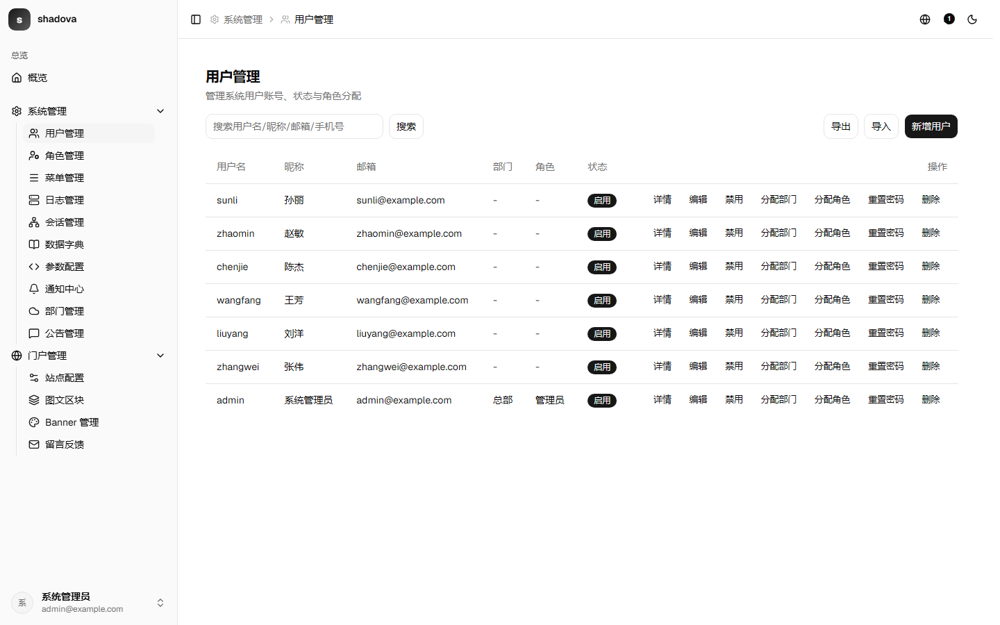
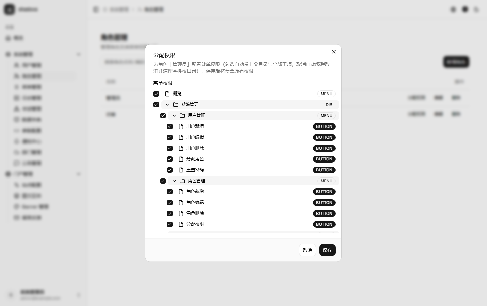
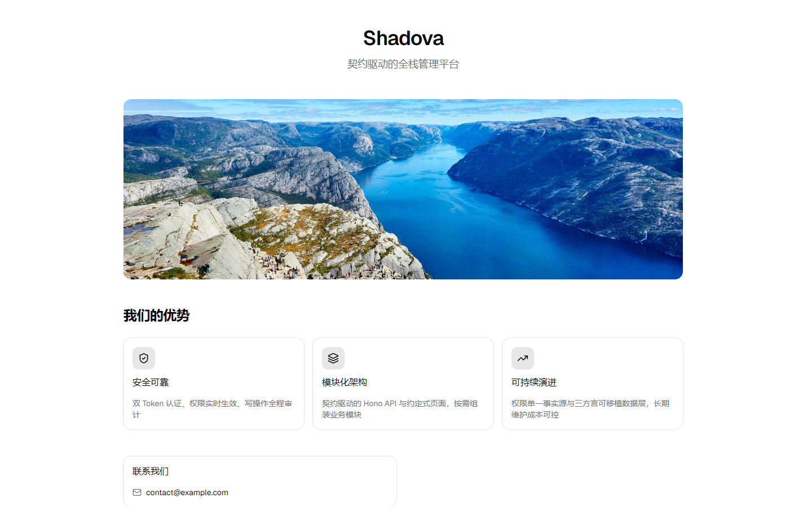
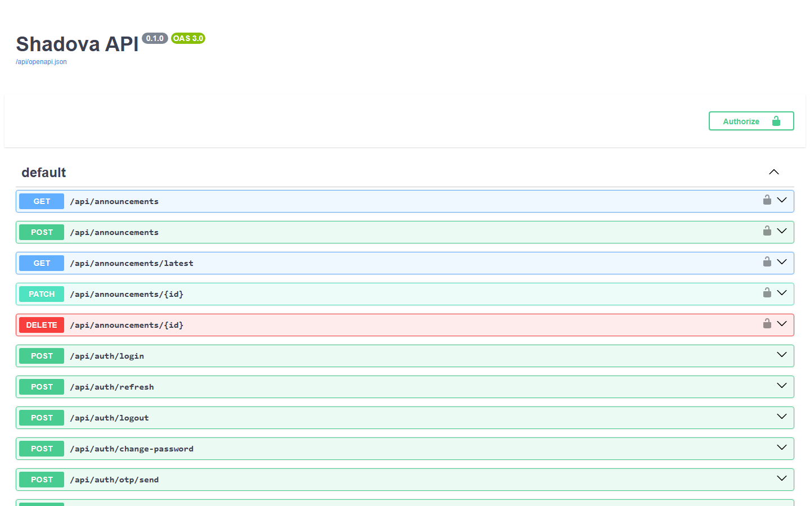

<div align="center">
  <h1>Shadova</h1>
  <p><strong>A contract-driven, testable full-stack RBAC admin monorepo.</strong></p>
  <p>
    <a href="https://github.com/nickiilord/shadova/actions/workflows/ci.yml"></a>
    
    =22">
    
    
  </p>
  <p>
    <a href="https://codespaces.new/nickiilord/shadova"></a>
  </p>
  <p><a href="./README.md">简体中文</a> · English · <a href="./README.ja.md">日本語</a></p>
</div>



`Shadova` combines a React admin app, Hono API, Prisma data layer, and shared RBAC rules in one Turborepo. It supports local JWT, email/SMS one-time codes, and Clerk authentication, while generating API documentation and frontend types from the same Zod/OpenAPI contract.

> [!IMPORTANT]
> `admin / Admin@123` is for local demos only. Replace the default credentials, configure production secrets, and connect a real email/SMS provider before deployment.

## Why Shadova

| Feature | Details |
|---|---|
| **Contract-driven** | One zod schema produces runtime validation, OpenAPI documentation, and TypeScript types for both apps; the contract artifacts are regenerated by a pre-commit hook, so the frontend cannot silently drift |
| **Strict permission intersection** | Effective permissions are the **intersection** of all assigned roles — there is no super-admin bypass. One implementation lives in `packages/shared` and is shared by menus, dynamic routes, page buttons, and API middleware |
| **Portable data layer** | A single Prisma schema runs on SQLite / MySQL / PostgreSQL, avoiding dialect-specific features (no enums, no recursive CTEs, no JSONB) |
| **Complete vertical slices** | 11 modules (users / roles / menus / departments / dictionaries / configs / announcements / notifications / logs / sessions / files), each with API + page + integration tests |
| **Public portal included** | `apps/portal` is a separate sign-in-free portal app (hero, carousel, content sections, message form) that shares the same backend |
| **Secure defaults** | Production JWT secret length is enforced, OTPs are stored hashed, and a missing production sender fails closed |
| **Verifiable delivery** | Vitest across three layers + Playwright E2E (52 cross-layer cases) + five GitHub Actions gates (test / lint / typecheck / build / e2e) |

> Compared with typical Next.js admin templates: the backend is **Hono** (deployable to edge runtimes), a **public portal app** ships alongside the admin, and the data layer is **portable across three SQL dialects**.

## Screenshots

| Admin · role permissions | Public portal |
|---|---|
|  |  |



## Quick Start

### Try it online (no local setup)

Click the **Open in GitHub Codespaces** badge above: GitHub creates a cloud environment with dependencies installed, the database created and demo data seeded. All three services start automatically with forwarded ports:

| Port | Service |
|---|---|
| 5173 | Admin app (`admin / Admin@123`) |
| 5174 | Public portal |
| 3001 | API (Swagger UI at `/api/docs`) |

> Forwarded ports are private by default; right-click in the editor's **PORTS** panel to make them public and share. Codespaces stops after 30 minutes idle and resumes when you reopen it.

### Requirements

- Node.js 22 or later
- pnpm 9.x (`pnpm@9.12.0` is pinned by the repository)

### Run locally

```bash
git clone https://github.com/nickiilord/shadova.git
cd shadova

cp apps/api/.env.example apps/api/.env
cp apps/web/.env.example apps/web/.env
cp packages/db/.env.example packages/db/.env

pnpm install
pnpm --filter @repo/db db:push
pnpm --filter @repo/db seed
pnpm dev
```

Open <http://localhost:5173> (admin) and <http://localhost:5174> (public portal). The API listens on <http://localhost:3001>; Swagger UI is available at <http://localhost:3001/api/docs>.

Demo credentials: `admin / Admin@123`. The idempotent seed can be rerun and resets this account's password and demo contact details.

## Features

- **Admin app**: React 19, Vite, React Router, TanStack Query, Tailwind CSS, and shadcn/ui.
- **Portal**: public single-page app (`apps/portal`, port 5174) with hero, carousel, content sections, contact/social links, and a message form; bilingual by browser language, with SEO metadata from site settings.
- **API**: Hono, Zod, `@hono/zod-openapi`, and Swagger UI.
- **Authentication**: username/password, email/SMS one-time codes, and Clerk hosted sign-in.
- **Authorization**: strict multi-role intersection shared by menus, dynamic routes, and page actions.
- **Data layer**: Prisma with SQLite, MySQL, and PostgreSQL.
- **Testing**: API integration tests, Web RTL tests, and pure shared permission tests.
- **Tooling**: Turborepo, GitHub Actions, strict TypeScript, ESLint, Husky, lint-staged, and commitlint.

## Repository Structure

```text
apps/
├── api/          # Hono API, port 3001 by default
├── web/          # React admin app, port 5173 by default
└── portal/       # Public portal (no sign-in), port 5174 by default
packages/
├── db/           # Prisma schema, client, and idempotent seed
├── shared/       # Pure authorization functions shared by web and API
└── config/       # Shared TypeScript and ESLint configuration
docs/
├── business/     # Business documentation (authoritative: model/authorization/rules/API/seed)
├── database/     # Database portability rules and reference DDL
└── review/       # Business review matrix (per-round check baseline)
```

## Authorization Model

A user's effective permissions are the **strict intersection** of every assigned role:

```text
effectivePermissions(user) = role₁ ∩ role₂ ∩ ... ∩ roleₙ
```

- If any role has no permissions, the result is empty. There is no super-admin bypass.
- `BUTTON` nodes participate in authorization but never appear in navigation or dynamic routes.
- The navigation tree restores required ancestors and collapses empty directories.
- Permission codes use `module:resource:action`, for example `system:user:create`.
- API `requirePermission(code)` is authoritative; frontend components only control visibility.

The algorithm has one implementation in [`packages/shared/src/permissions.ts`](./packages/shared/src/permissions.ts).

## Authentication and OTP

The web and API providers must match:

```dotenv
# Local mode
VITE_AUTH_PROVIDER=local
AUTH_PROVIDER=local

# Clerk mode
VITE_AUTH_PROVIDER=clerk
VITE_CLERK_PUBLISHABLE_KEY="pk_..."
AUTH_PROVIDER=clerk
CLERK_SECRET_KEY="sk_..."
```

In development, `DevOtpSender` prints codes to the API console and keeps them only in process memory. The database always stores hashes. OTPs expire after 5 minutes, have a 60-second cooldown, and allow at most 5 attempts.

## Database

The Prisma schema is the runtime source of truth; `docs/database/schema.sql` is reference DDL. To switch databases:

1. Update `DATABASE_URL` in `packages/db/.env`.
2. Update `datasource.db.provider` in `packages/db/prisma/schema.prisma`.
3. Run a migration and reseed:

```bash
pnpm --filter @repo/db db:migrate -- --name switch-database
pnpm --filter @repo/db seed
```

See the [database guide](./docs/database/README.md) for dialect differences.

## OpenAPI

Swagger UI: <http://localhost:3001/api/docs>

Regenerate the contract and frontend types after changing the API:

```bash
pnpm --filter @repo/api generate:openapi
pnpm --filter @repo/api generate:types
```

The generated files are `apps/api/openapi.json` and `apps/web/src/api/schema.d.ts`. The pre-commit hook refreshes them when API source files change.

## Development

```bash
# Start all development services
pnpm dev

# Test, build, and lint
pnpm turbo test
pnpm turbo build
pnpm turbo lint

# Recreate demo data
pnpm --filter @repo/db seed
```

API integration tests rebuild a dedicated SQLite test database and do not modify the development database. Before production startup, set a random `JWT_SECRET` with at least 32 characters; the development placeholder is rejected.

## Documentation

- [Database and authorization semantics](./docs/database/README.md)
- [Business documentation](./docs/business/README.md)
- [Business review matrix](./docs/review/business-rules.md)
- [Agent development guide](./CLAUDE.md)

## Contributing

See [CONTRIBUTING.md](./CONTRIBUTING.md) for the development rules and the pre-submit checklist; [AGENTS.md](./AGENTS.md) is the single source of truth for repository conventions.

Commit messages follow [Conventional Commits](https://www.conventionalcommits.org/). For larger features, describe the approach in an issue first.
